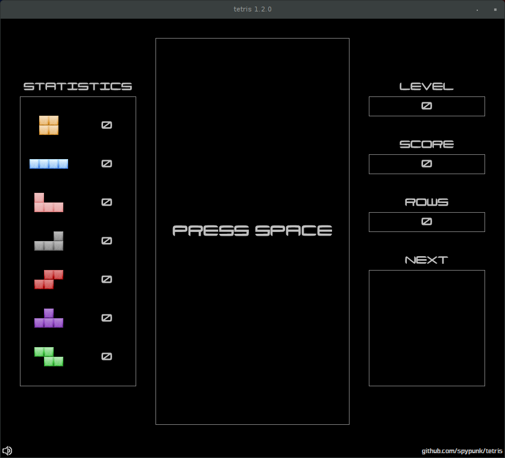

# tetris - Just another Tetris™ clone 
    
## How it looks ?

## How to build it ?

You will need a Java JDK 8+ and maven 3+.

Execute **mvn clean package assembly:single** to build the release package.

## How to play ?

- SPACE - Start a new game

- LEFT - Move the current shape to the left

- RIGHT - Move the current shape to the right

- DOWN - Move the current shape down

- UP - Rotate the current shape clockwise

- CTRL - "Hard drop" current shape

- P - Pause the current game

- M - Mute sound

- PAGE UP - Increase the volume

- PAGE DOWN - Decrease the volume

## What about license ?

This project is licensed under the WTFPL (Do What The Fuck You Want To Public License)

