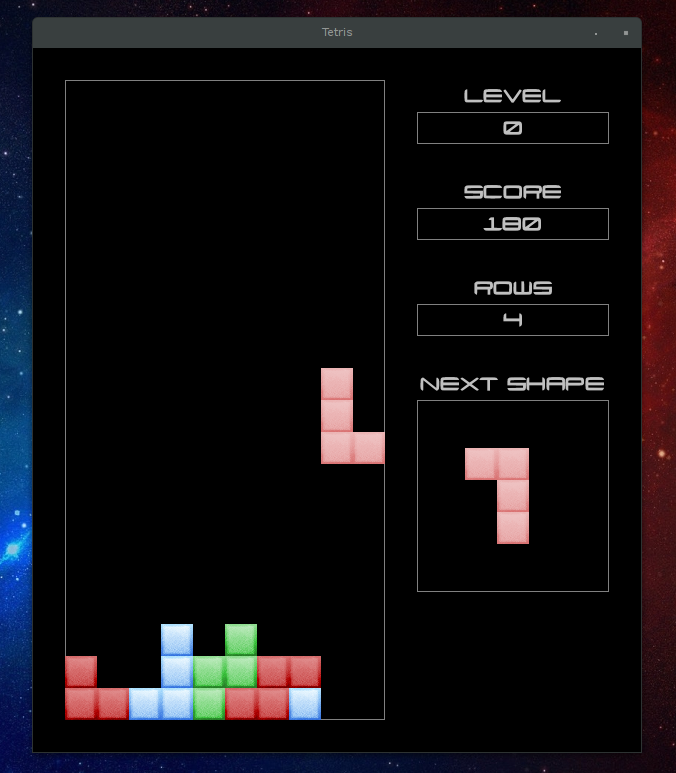
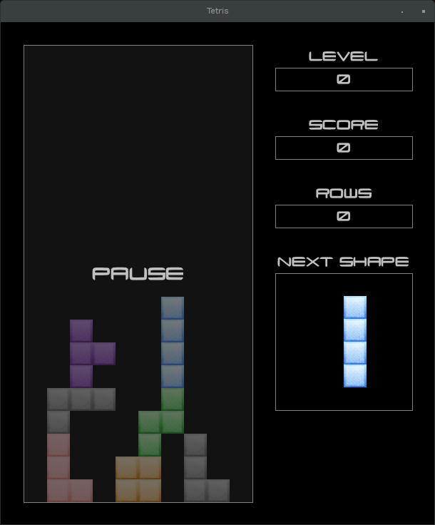

# tetris - Just another Tetris™ clone
      
## How it looks ?

## How to build it ?

You will need a Java JDK 8+ and maven 3+.

## How to play ?

### Controls

LEFT - Move the current shape to the left

RIGHT - Move the current shape to the right

DOWN - Move the current shape down

UP - Rotate the current shape clockwise

SPACE - Start a new game

P - Pause the current game

## What about license ?

This project is licensed under the WTFPL (Do What The Fuck You Want To Public License)

